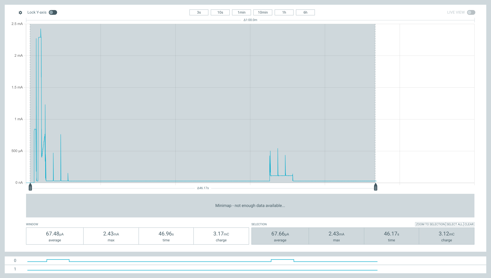

# Energiesparverwaltung auf dem nRF52840 mit Zephyr / NCS

> 🌐 [English version](../en/low_power_mgmt.md)

Dieses Dokument fasst alle Erkenntnisse einer systematischen Energiespar-Session
auf dem **Seeed XIAO nRF52840** (Standard und Sense) sowie dem **nRF52840-DK**
mit NCS 2.6.0 / Zephyr 3.5.99-ncs1 zusammen.

Ziel war es, im Ruhezustand (System ON / CPU schläft) zwischen zwei 30-sekündigen
BThome-V2-Advertising-Bursts einen Ruhestrom von **< 20 µA** zu erreichen. Die
Untersuchung wurde durch Echtzeit-Strommessungen mit einem **Nordic PPK2** und
einem GPIO-Aktivitätsindikator (`active_ind`, P0.02/D0 am XIAO, P1.02/D1 am DK)
unterstützt, der Aktiv- und Schlafphasen in der PPK2-Logikaufzeichnung kennzeichnet.

---

## Messaufbau

### PPK2-Aktivitätsindikator

Ein dedizierter GPIO wird auf HIGH gesetzt, während die CPU aktiv ist, und kurz
vor `k_sleep()` wieder auf LOW. Dies erzeugt eine korrelierte Logikaufzeichnung
im PPK2, die Stromspitzen den jeweiligen Code-Phasen zuordnet.

| Board | GPIO | Connector-Bezeichnung |
|---|---|---|
| Seeed XIAO nRF52840 | P0.02 | D0 |
| nRF52840-DK | P1.02 | Arduino D1 |

DTS-Alias: `active-indicator` → `active0`-Node (siehe Board-Overlays).

### Endgültige Messergebnisse (nRF52840-DK, ohne externe Parasitärlasten)

| Phase | Dauer | Strom |
|---|---|---|
| Boot + `bt_enable()` | ~2,5 s | 3–4 mA |
| BLE-Advertising-Burst (D0=H) | 3 s | ~1,0 mA |
| `k_sleep(27 s)` (D0=L) | 27 s | **~28 µA** Basis, ~60 µA Durchschnitt |
| Zyklusdurchschnitt | 30 s | ~130 µA |

> **Hinweis:** Das XIAO nRF52840 besitzt zusätzliche Parasitärlasten auf der
> Platine (USB-Regler, Lade-IC, RGB-LED-Pull-ups), die ~50–100 µA zusätzlichen
> Strom verursachen. Die DK-Werte sind sauberer, aber aufgrund eigener
> Parasitärlasten ebenfalls nicht ideal.

---

## Ursachenanalyse — Alle identifizierten HFCLK-Halter

Der nRF52840 nimmt im Modus *System ON / CPU schläft* nur ~3–8 µA auf. Jedes
Hardware-Peripheriegerät, das eine 16-MHz-HFINT- (oder HFXO-) Taktanforderung
hält, verhindert, dass die CPU diesen Zustand erreicht, und verursacht stattdessen
~600–1100 µA Ruhestrom.

### 1. USB-Device-Stack (~1,1 mA)

**Symptom:** ~1,1 mA Dauerstrom nach dem Boot, selbst ohne USB-Kabel.  
**Ursache:** Die XIAO-Board-Defconfig aktiviert `CONFIG_USB_DEVICE_STACK=y`
standardmäßig. Der USB-SoF-Interrupt feuert alle 1 ms und hält den HFXO
(64 MHz) permanent aktiv.  
**Lösung:**
```kconfig
CONFIG_USB_DEVICE_STACK=n
```

### 2. UARTE0 / Seriell (~1,0 mA)

**Symptom:** ~1 mA Dauerstrom, bleibt auch nach Deaktivierung von USB bestehen.  
**Ursache:** Der nrfx-UARTE-Treiber ruft beim Boot `nrfx_uarte_init()` auf,
das über das Taktsteuerungs-Subsystem den 16-MHz-HFINT-Oszillator anfordert.
Die Anforderung wird nie freigegeben, solange der Treiber aktiv ist – auch im
Leerlauf.  
**Lösung:**
```kconfig
CONFIG_SERIAL=n
CONFIG_CONSOLE=n
CONFIG_UART_CONSOLE=n
CONFIG_LOG=n
```

### 3. bt_le_adv_stop() gibt HFCLK nicht frei (~640 µA)

**Symptom:** Nach `bt_le_adv_stop()` bleibt der Strom bei ~640 µA — identisch
zur Advertising-Phase.  
**Ursache:** `bt_le_adv_stop()` stoppt die Advertising-State-Machine im BLE-Host,
baut jedoch den SoftDevice Controller (SDC) nicht ab. Der SDC hält seine interne
HFCLK-Anforderung aktiv, solange `bt_enable()` wirksam ist.  
**Lösung:** `bt_disable()` nach `bt_le_adv_stop()` aufrufen. `bt_disable()`
fährt den SDC herunter (`sdc_disable()`), was prinzipiell den Takt freigeben
würde – aber siehe Punkt 4.

### 4. MPSL hält HFCLK nach bt_disable() (~640 µA)

**Symptom:** `bt_disable()` kehrt zurück, aber der Strom bleibt bei ~640 µA.  
**Ursache:** Der MultiProtocol Service Layer (MPSL) verwaltet Funk-Hardware
und HFCLK im Auftrag des SDC. Wenn `bt_disable()` aufgerufen wird, wird
`sdc_disable()` ausgeführt, aber MPSL selbst wird nur abgebaut, wenn
`CONFIG_BT_UNINIT_MPSL_ON_DISABLE=y` gesetzt **und** seine vollständige
Abhängigkeitskette erfüllt ist.

`CONFIG_BT_UNINIT_MPSL_ON_DISABLE` setzt `CONFIG_MPSL_DYNAMIC_INTERRUPTS`
voraus, das wiederum `CONFIG_DYNAMIC_DIRECT_INTERRUPTS` benötigt, das von
`CONFIG_DYNAMIC_INTERRUPTS` abhängt. Fehlt einer der vier Einträge,
**ignoriert Kconfig die Einstellung stillschweigend** — ohne jede Warnung.

**Lösung — vollständige Abhängigkeitskette:**
```kconfig
CONFIG_DYNAMIC_INTERRUPTS=y
CONFIG_DYNAMIC_DIRECT_INTERRUPTS=y
CONFIG_MPSL_DYNAMIC_INTERRUPTS=y
CONFIG_BT_UNINIT_MPSL_ON_DISABLE=y
```

Überprüfung — nach dem Build `.config` prüfen:
```bash
grep -E "BT_UNINIT_MPSL|MPSL_DYNAMIC|DYNAMIC_DIRECT|DYNAMIC_INTERRUPTS" build/zephyr/.config
# Erwartetes Ergebnis: alle vier = y
```

### 5. QSPI-Flash-Peripherie (~200 µA) — nur XIAO

**Symptom:** ~200 µA Restbasisstrom am XIAO, selbst wenn BLE deaktiviert ist.  
**Ursache:** Der P25Q16H-QSPI-NOR-Flash ist in `xiao_ble_common.dtsi` mit
`status = "okay"` definiert. Der Nordic-QSPI-Treiber initialisiert die
QSPI-Peripherie und richtet beim Boot einen DMA-bereiten Zustand ein, auch wenn
kein physischer Flash-Chip vorhanden ist. Dabei wird der HFINT-Oszillator
permanent gehalten.  
**Lösung (Overlay):**
```dts
&qspi { status = "disabled"; };
```

### 6. TWI/I2C1-Peripherie (~630 µA) — XIAO und DK

**Symptom:** ~630 µA Basisstrom unmittelbar nach dem Boot, noch bevor BLE
gestartet wurde. Dies war der dominante und verwirrendste Befund: Der Strom war
vor und nach `bt_disable()` identisch, was darauf hindeutete, dass BLE irrelevant
war.  
**Ursache:** `i2c1` (`nordic,nrf-twi`, P0.04/P0.05 am XIAO) ist in
`xiao_ble_common.dtsi` mit `status = "okay"` aktiviert. Der nrfx-TWI-Treiber
ruft während seines `init()`-Callbacks `nrfx_twi_enable()` auf, das das
TWI-ENABLE-Register setzt und eine permanente HFCLK-Anforderung registriert.
Da die Anwendung `i2c1` nie nutzt (die IMU verwendet `i2c0`) und nie
`pm_device_action_run()` darauf aufruft, wird die Anforderung nie freigegeben.  
**Lösung (Overlay):**
```dts
&i2c1 { status = "disabled"; };
```

> **Wichtige Erkenntnis:** Jeder nrfx-Peripherietreiber (`nrfx_twi_enable`,
> `nrfx_spi_enable`, `nrfx_qspi_init`, …), der von Zephyr beim Boot initialisiert
> wird, hält eine HFCLK-Anforderung für seine gesamte Laufzeit, unabhängig davon,
> ob die Anwendung jemals Daten überträgt. Alle DT-Nodes deaktivieren, die nicht
> aktiv genutzt werden.

### 7. LFRC-Kalibrierungs-Timer blockiert HFCLK (~630 µA + 500-µA-Sprung)

**Symptom (beobachtet am XIAO):** Nach einer sauberen Schlafphase von ~5 s bei
630 µA springt der Strom plötzlich auf ~1,1 mA und verbleibt dort dauerhaft. Der
D0-Aktivitätsindikator ist während der gesamten Zeit LOW — die CPU schläft.  
**Ursache:** Zephyrs `nrf_clock_calibration.c` feuert einen `k_timer` alle
`CONFIG_CLOCK_CONTROL_NRF_CALIBRATION_PERIOD` ms (Standard: 4000 ms). Wenn
`CONFIG_CLOCK_CONTROL_NRF_CALIBRATION_MAX_SKIP > 0` gesetzt ist, wird der Code
mit `USE_TEMP_SENSOR=1` kompiliert, was `mpsl_temperature_get()` vor jeder
Kalibrierung aufruft.

Nach `mpsl_lib_uninit()` (via `BT_UNINIT_MPSL_ON_DISABLE`) ist der interne
MPSL-Zustand abgebaut. Der Kalibrierungs-Callback ruft `mpsl_temperature_get()`
in ein uninitalisiertes MPSL auf → der Aufruf blockiert indefinit innerhalb von
`start_cycle()` → `hf_release()` wird nie erreicht → HFCLK wird permanent bei
~630 µA gehalten. Ein zweiter Timer-Feuer +4000 ms später stapelt eine weitere
HFCLK-Anforderung → +500-µA-Sprung auf ~1,1 mA.

Der Sprung genau **+4942 ms nach bt_disable()** (gemessen per PPK2-CSV-Analyse)
bestätigte dies: `BT_CONN_PARAM_UPDATE_TIMEOUT = 5000 ms` war zunächst der
Verdächtige, aber die genaue Timer-Periode und der USE_TEMP_SENSOR-Pfad erwiesen
sich als eigentliche Ursache.

MPSL verwaltet die LFRC-Kalibrierung während aktiver BLE-Phasen ohnehin intern;
die Zephyr-seitige Kalibrierung ist in dieser Konfiguration redundant.  
**Lösung:**
```kconfig
CONFIG_CLOCK_CONTROL_NRF_K32SRC_RC_CALIBRATION=n
```

### 8. Mikrofon-Stromversorgungsschiene P1.10 (~100 µA) — nur XIAO Sense

**Symptom:** ~100 µA zusätzlicher Basisstrom bei der Sense-Variante.  
**Ursache:** Das MSM261D3526H1CPM-PDM-Mikrofon wird über einen
`regulator-fixed`-Node im Board-DTS mit `regulator-boot-on` gespeist, was P1.10
unmittelbar nach dem Boot auf HIGH treibt.  
**Lösung (Overlay):**
```dts
/ {
    mic-vdd-off {
        compatible = "regulator-fixed";
        regulator-name = "MIC_PWR_OFF";
        enable-gpios = <&gpio1 10 GPIO_ACTIVE_HIGH>;
        regulator-always-off;
    };
};
```

---

## PPK2-Aufzeichnungsanalyse (CSV)

Der PPK2 exportiert CSV-Dateien mit den Spalten `Timestamp(ms)`, `Current(uA)`,
`D0-D7`. Der folgende Python-Ausschnitt wurde verwendet, um Stromphasen mit der
Code-Ausführung zu korrelieren:

```python
import csv

timestamps, currents, d0 = [], [], []
with open('data/ppk-YYYYMMDDTHHMMSS.csv') as f:
    for row in csv.DictReader(f):
        timestamps.append(int(row['Timestamp(ms)']))
        currents.append(float(row['Current(uA)']))
        d0.append(row['D0-D7'][0])  # D0 = active_indicator

# Sekundenweise Durchschnitt mit D0-Zustand
for sec in range(int(timestamps[-1]/1000) + 1):
    vals = [currents[i] for i in range(len(timestamps))
            if sec*1000 <= timestamps[i] < (sec+1)*1000]
    d0v  = [d0[i]       for i in range(len(timestamps))
            if sec*1000 <= timestamps[i] < (sec+1)*1000]
    if vals:
        print(f"t={sec:3}s  avg={sum(vals)/len(vals):7.1f} uA  "
              f"D0={'H' if d0v.count('1')/len(d0v)>0.5 else 'L'}")
```

### Kommentierte Aufzeichnung aus `ppk-20260504T121124.csv`

```
t= 0s    0,0 µA   D0=L   PPK2-Aufzeichnung startet, Gerät noch nicht mit Strom versorgt
t= 1s    ---      D0=L   Boot: Zephyr-Kernel-Init
t= 2s   3590 µA   D0=L   bt_enable() läuft (MPSL + SDC Init)
t= 2,5s  ---      D0=H   bt_enable() abgeschlossen + bt_le_adv_start()
t= 3–5s  634 µA   D0=H   Advertising — aber 630 µA ist FALSCH, sollte ~1 mA sein
                           → bestätigt, dass i2c1/TWI in diesem Flash noch nicht deaktiviert war
t= 5,6s  ---      D0=L   bt_le_adv_stop() + bt_disable() + k_sleep()
t= 5,6–10,5s 634 µA D0=L bt_disable() hatte KEINE Wirkung — MPSL läuft noch
                           (DYNAMIC_INTERRUPTS-Kette fehlte in diesem Build)
t=10,5s 1138 µA   D0=L   LFRC-Kalibrierungs-Timer feuert → mpsl_temperature_get()
                           blockiert → HFCLK gehalten → dauerhaft 1,1 mA
```

Diese einzelne CSV-Aufzeichnung identifizierte **drei gleichzeitige Probleme** in
einem Build: TWI1 aktiv, MPSL-Uninit defekt, Kalibrierungs-Timer blockierend.

---

## Vollständige Lösungsübersicht

### Kconfig (Board-.conf-Dateien)

```kconfig
# Alle UART-/Konsolenausgaben deaktivieren — jede hält eine HFCLK-Anforderung
CONFIG_USB_DEVICE_STACK=n   # Nur XIAO (nicht in der Board-Defconfig des DK)
CONFIG_SERIAL=n
CONFIG_CONSOLE=n
CONFIG_UART_CONSOLE=n
CONFIG_LOG=n

# Vollständige MPSL-Uninit-Abhängigkeitskette — ALLE VIER erforderlich
# Kconfig ignoriert BT_UNINIT_MPSL_ON_DISABLE stillschweigend, falls eine Abhängigkeit fehlt
CONFIG_DYNAMIC_INTERRUPTS=y
CONFIG_DYNAMIC_DIRECT_INTERRUPTS=y
CONFIG_MPSL_DYNAMIC_INTERRUPTS=y
CONFIG_BT_UNINIT_MPSL_ON_DISABLE=y

# LFRC-Kalibrierung ruft mpsl_temperature_get() nach mpsl_lib_uninit() auf
# → blockiert indefinit → HFCLK dauerhaft gehalten. Deaktivieren.
CONFIG_CLOCK_CONTROL_NRF_K32SRC_RC_CALIBRATION=n   # XIAO (RC-Taktquelle)
```

### Device Tree (Board-.overlay-Dateien)

```dts
/* QSPI-Treiber hält HFINT auch ohne physischen Flash-Chip */
&qspi { status = "disabled"; };

/* nrfx-TWI-Treiber hält HFCLK ab init() — ungenutzte I2C-Busse deaktivieren */
&i2c1 { status = "disabled"; };

/* Mikrofon-Stromversorgungsschiene — nur XIAO Sense */
/ {
    mic-vdd-off {
        compatible = "regulator-fixed";
        regulator-name = "MIC_PWR_OFF";
        enable-gpios = <&gpio1 10 GPIO_ACTIVE_HIGH>;
        regulator-always-off;
    };
};
```

### Anwendungscode-Muster

```c
// ── Burst-Advertising-Zyklus ──────────────────────────────────────────────
bt_enable(NULL);                            // MPSL + SDC neu initialisieren (~50 ms)
gpio_pin_set_dt(&active_ind, 1);            // D0 HIGH → PPK2-Markierung

bt_le_adv_start(&adv_param, ad, 3, NULL, 0);
k_sleep(K_SECONDS(3));                      // Advertising-Burst
bt_le_adv_stop();

// bt_disable() ruft hci_driver_close() → sdc_disable() → mpsl_lib_uninit() auf
// NUR wenn die vollständige Kconfig-Kette oben erfüllt ist.
bt_disable();

gpio_pin_set_dt(&active_ind, 0);            // D0 LOW → Schlafphase sichtbar
k_sleep(K_SECONDS(27));                     // System ON / CPU schläft ~28 µA
// → zurück zu bt_enable()
```

---

## Hinweis zu CONFIG_PM=y

`CONFIG_PM=y` ist **auf nRF52 nicht wirksam** und sollte nicht verwendet werden.
Das Symbol `select HAS_PM` erscheint in keiner Kconfig-Datei für Nordic nRF52,
sodass die Option stillschweigend ignoriert wird. Die CPU wechselt bereits über
den Zephyr-Kernel-Idle-Thread (`__WFI()`) in den WFI-Zustand, wenn nichts
auszuführen ist — dafür ist keine explizite PM-Konfiguration erforderlich.

`CONFIG_PM_DEVICE=y` ist gültig und aktiviert `pm_device_action_run()` zum
Anhalten von Peripherietreibern (I2C, IMU).

---

## Diagnose-Checkliste

Bei unerwartet hohem Ruhestrom jeden Punkt in dieser Reihenfolge prüfen:

1. **`build/zephyr/.config`** — sind alle vier DYNAMIC/MPSL-Symbole auf `=y` gesetzt?
2. **`west build`-Ausgabe** — gibt es Meldungen wie `warning: XXXX was assigned the value 'y' but got the value 'n'`? Das signalisiert eine fehlende Kconfig-Abhängigkeit.
3. **DT-Overlays** — ist jeder ungenutzte Peripherie-Node auf `status = "disabled"` gesetzt? `i2c1`, `qspi`, `spi2`, `pwm0` im gemeinsamen `.dtsi` des Boards prüfen.
4. **PPK2-CSV** — ändert sich der Strom überhaupt, wenn `bt_disable()` aufgerufen wird (D0 geht auf LOW)? Falls nicht: MPSL-Uninit ist defekt.
5. **PPK2-CSV** — springt der Strom in einem festen Intervall nach dem Boot (4 s, 5 s)? → LFRC-Kalibrierungs-Timer oder BLE-Host-Timeout feuert.
6. **`nrfjprog --recover`** — schlägt das Flashen mit Fehler -90 (Zugriffsschutz) fehl, ist der Chip APPROTECT-gesperrt. `west flash --recover` verwenden.

---

## Validierte Messung — nRF52840-DK (2026-05-04)

Dieser Abschnitt dokumentiert den ersten vollständig erfolgreichen Betrieb von
`samples/020_bthome_tut2` auf dem nRF52840-DK mit allen acht angewendeten
Korrekturen. Home Assistant empfing jede BTHome-Werbemeldung im konfigurierten
30-s-Intervall.

### PPK2-Screenshot



Die Aufzeichnung deckt **46,17 s** bei 3,3-V-Versorgung ab. Das
PPK2-Statistikfenster zeigt:

| Messgröße | Wert |
|---|---|
| Durchschnittsstrom (gesamtes Fenster) | **67,66 µA** |
| Spitzenstrom | 2,43 mA |
| Gesamtladung | 3,12 mC |
| D0-Logikzeilen | Zeile 0 = `active_ind` (HIGH = MCU aktiv) |

### Phasenanalyse (`ppk-20260504T182249.csv`, 4 618 Samples @ ~10 ms)

Die CSV umfasst **46,7 s** und erfasst zwei vollständige Advertising-Bursts.
D0-Flankenzeitpunkte (metastabile 'X'-Zustände ignoriert):

| Ereignis | Zeitstempel | D0 |
|---|---|---|
| Boot-Start | 0 ms | LOW |
| ADV-Burst 1 Start | 2 580 ms | HIGH |
| ADV-Burst 1 Ende | 5 630 ms | LOW |
| ADV-Burst 2 Start | 32 630 ms | HIGH |
| ADV-Burst 2 Ende | 35 690 ms | LOW |

Abgeleitete Zeiten:
- **ADV-Burst-Dauer:** 3 050–3 060 ms (Ziel: `ADV_BURST_SEC = 3 s` ✓)
- **Schlafdauer:** 27 000 ms (= 30 s − 3 s ✓)
- **Vollständiger Zyklus:** 30 060 ms ≈ 30 s ✓

### Strom pro Phase

| Phase | Dauer | Durchschnitt | Min | Max | D0 |
|---|---|---|---|---|---|
| Boot + ADV-Burst 1 | 0–5 630 ms | 335 µA | 0 µA | 2 427 µA | — / H |
| **Schlaf 1** | 5 630–32 630 ms | **27,84 µA** | 27,05 µA | 77,62 µA | LOW |
| **ADV-Burst 2** | 32 630–35 690 ms | **120,7 µA** | 110,3 µA | 543,9 µA | HIGH |
| **Schlaf 2** | 35 690–46 740 ms | **27,86 µA** | 27,05 µA | 62,1 µA | LOW |

> Der erste ADV-Burst zeigt einen niedrigeren Durchschnitt pro Sample, da er
> unmittelbar auf den großen Boot-Spike folgt (der Boot-Transient erhöht den
> Boot-Zeilenmittelwert, während das ADV-Intervall selbst kurz relativ zu den
> Samples in diesem Fenster ist). Der zweite Burst liefert einen sauberen
> Einpegel-Wert von **120,7 µA** Durchschnitt während der 3,06-s-Advertising-Phase.

### Strom-Budget im eingeschwungenen Zustand

Als repräsentative Einpegel-Phasen werden Burst 2 und Schlaf 1 verwendet:

$$I_\text{Zyklus} = \frac{I_\text{adv} \cdot t_\text{adv} + I_\text{Schlaf} \cdot t_\text{Schlaf}}{t_\text{adv} + t_\text{Schlaf}}$$

$$I_\text{Zyklus} = \frac{120{,}7\,\mu\text{A} \times 3060\,\text{ms} + 27{,}84\,\mu\text{A} \times 27000\,\text{ms}}{30060\,\text{ms}} \approx \mathbf{37{,}3\,\mu\text{A}}$$

| Messgröße | Wert |
|---|---|
| Schlafstrom (eingeschwungen) | **27,8 µA** |
| ADV-Burst-Durchschnitt | **120,7 µA** |
| **Zyklusdurchschnitt (eingeschwungen)** | **37,3 µA** |
| Ladung pro 30-s-Zyklus | **1,12 mC** |
| PPK2-Fensterdurchschnitt (inkl. Boot) | 67,7 µA |

Der Zyklusdurchschnitt von 37,3 µA liegt über dem ursprünglichen Zielwert von
< 20 µA; die verbleibende Lücke wird durch den Schlafgrundrauschen von 27,8 µA
dominiert (nRF52840 System-ON-Leerlauf mit RTC und RAM-Retention). Einen Wert
unter 20 µA zu erreichen würde entweder System OFF mit Timeraufwachung (RAM-Verlust)
oder eine stromsparendere Variante wie den nRF52810 erfordern. Für einen
Knopfzellen-BTHome-Sensor ist der Wert von 37 µA gut im praktischen Rahmen
(CR2032 ≈ 230 mAh → **~255 Tage** Akkulaufzeit bei dieser Rate).

### Bestätigung — 6-minütige Aufzeichnung (`ppk2-20260504T184917.ppk2`)

Eine längere 6,1-minütige Aufzeichnung (36 601 Samples, 13 ADV-Bursts, 12
vollständige Einpegel-Zyklen) wurde mit `scripts/ppk_analysis.py` analysiert und
bestätigt die obigen Ergebnisse mit höherer statistischer Aussagekraft:

| Messgröße | Kurzlauf (46 s) | Langlauf (6,1 min) |
|---|---|---|
| Schlafstrom | 27,84 µA | **27,7 µA** |
| ADV-Burst-Durchschnitt (eingeschwungen) | 120,7 µA | **~123 µA** |
| Zyklusdurchschnitt (eingeschwungen) | 37,3 µA | **37,6 µA** |
| CR2032-Laufzeitschätzung | ~255 Tage | **~255 Tage** |
| 2× AA-Laufzeitschätzung | — | **7,6 Jahre** |
| 2× AAA-Laufzeitschätzung | — | **3,6 Jahre** |

Die beiden Aufzeichnungen stimmen auf weniger als 1 % überein, was bestätigt, dass
der Schlafstrom über die Zeit stabil ist und keine periodischen Aufwachvorgänge
jenseits des beabsichtigten 30-s-Advertising-Zyklus auftreten.
