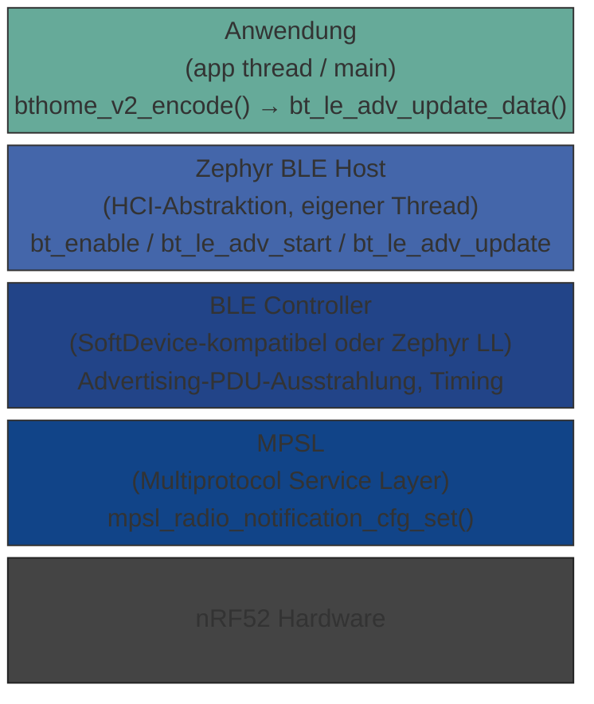

# Zephyr BLE-Stack: Hooks und Muster für Sensordatenaktualisierung

> 🌐 [English version](../en/zephyr-ble-stack.md)

Dieses Dokument beschreibt die wichtigsten Einstiegspunkte (Hooks) des Zephyr
Bluetooth-Stacks, die für BThome-V2-Projekte relevant sind, und erklärt, wie
sich der Ansatz von Arduino/PlatformIO und dem Nordic SoftDevice unterscheidet.

---

## 1. Architekturüberblick

Zephyr trennt den BLE-Stack strikt vom Anwendungscode:



Der Host-Stack läuft in einem **eigenen Kernel-Thread** (`bt_rx`, `bt_tx`).
Alle API-Aufrufe aus dem App-Thread sind Thread-safe, solange keine rohen
HCI-Buffer direkt geteilt werden.

---

## 2. Relevante Hooks im BLE-Stack

### 2.1 `bt_enable()` — Initialisierungs-Callback

```c
// Asynchrone Initialisierung mit Callback
bt_enable(bt_ready_cb_t cb);

// Callback-Signatur
static void bt_ready(int err) {
    if (err == 0) {
        bt_le_adv_start(...);
    }
}
```

**Wann nutzen:** Wenn BLE-Init länger dauert (z. B. bei aktiviertem
`CONFIG_BT_SETTINGS` — Flash-gespeicherte Bonds werden geladen).  
**Für BThome:** Meist reicht synchrones `bt_enable(NULL)` + direkter
Aufruf von `bt_le_adv_start()`, da kein Bonding benötigt wird.

---

### 2.2 `bt_le_adv_start()` / `bt_le_adv_update_data()`

```c
// Advertising starten
int bt_le_adv_start(const struct bt_le_adv_param *param,
                    const struct bt_data *ad, size_t ad_len,
                    const struct bt_data *sd, size_t sd_len);

// Laufende Advertisement-Payload ersetzen (kein Stop/Start nötig)
int bt_le_adv_update_data(const struct bt_data *ad, size_t ad_len,
                          const struct bt_data *sd, size_t sd_len);
```

`bt_le_adv_update_data()` ist der **zentrale Hook für BThome**: Er tauscht
den Service-Data-Buffer des laufenden Advertising-Sets atomar aus, ohne die
BLE-Advertising-Sequenz zu unterbrechen.

**BThome-Muster** (wie in `010_bthome-tut1` implementiert):

```c
// Im App-Thread, alle N Sekunden:
bthome_v2_clear(&bthome);
bthome_v2_add_packet_id(&bthome, pkt_id++);
sensor_die_temp_update(&bthome);   // Daten eintragen
sensor_imu_update(&bthome);
bthome_v2_encode(&bthome);         // OBJ_IDs sortieren, Buffer füllen
bthome_v2_get_bt_data(&bthome, &ad[2]);
bt_le_adv_update_data(ad, ARRAY_SIZE(ad), NULL, 0); // atomar übergeben
```

---

### 2.3 Extended Advertising — `bt_le_ext_adv_*`

Ab Zephyr 3.x / NCS 2.x steht eine erweiterte Advertising-API bereit:

```c
struct bt_le_ext_adv *adv;
bt_le_ext_adv_create(&param, &cb, &adv);
bt_le_ext_adv_set_data(adv, ad, ad_len, NULL, 0);
bt_le_ext_adv_start(adv, &start_param);
```

Callbacks (`struct bt_le_ext_adv_cb`):

| Callback | Auslöser |
|----------|----------|
| `sent` | Nach jedem gesendeten Advertisement-Event |
| `scanned` | Wenn ein Scanner auf das Advertisement reagiert (Scan Response) |
| `connected` | Bei eingehender Verbindung (connectable advertising) |

**Für BThome relevant:** Der `sent`-Callback erlaubt es, Sensordaten
**genau nach jedem gesendeten Paket** zu aktualisieren — feinkörniger als
ein Sleep-basierter Loop. Erfordert `CONFIG_BT_EXT_ADV=y`.

```c
static struct bt_le_ext_adv_cb adv_cb = {
    .sent = on_adv_sent,
};

static void on_adv_sent(struct bt_le_ext_adv *adv,
                        struct bt_le_ext_adv_sent_info *info)
{
    // Wird nach jedem ADV-Event im BT-Host-Thread aufgerufen
    // → k_work einplanen, um Sensordaten im App-Thread zu lesen
    k_work_submit(&sensor_update_work);
}
```

> **Achtung:** Der Callback läuft im BT-Host-Thread. Sensor-I²C-Zugriffe
> müssen per `k_work` oder `k_msgq` in den App-Thread ausgelagert werden.

> **Energiespar-Tipp:** Das Sensor-Update *nach* dem Senden durchzuführen
> ist energetisch optimal, weil MCU und Radio in diesem Moment ohnehin aktiv
> sind. Würde man die Messung stattdessen kurz *vor* dem Senden planen,
> müsste das System entweder **zweimal pro Zyklus aufwachen** (einmal für
> die Messung, einmal für den TX) oder zwischen Messung und TX
> **dauerhaft wach bleiben** — beides kostet deutlich mehr Energie. Mit dem
> `sent`-Callback gibt es genau **ein Wach-Fenster pro Intervall**, in dem
> sowohl Übertragung als auch Datenvorbereitung für das nächste Paket
> erledigt werden.

---

### 2.4 `k_work` / `k_work_delayable` — empfohlenes Muster

Für Sensor-Updates ohne blockierendes Sleep:

```c
static struct k_work_delayable adv_update_work;

static void do_adv_update(struct k_work *work)
{
    // Sensordaten lesen und Advertisement aktualisieren
    update_advertisement();
    // Nächste Aktualisierung einplanen
    k_work_reschedule(&adv_update_work, K_SECONDS(ADVERT_INTERVAL_SEC));
}

int main(void)
{
    k_work_init_delayable(&adv_update_work, do_adv_update);
    // ...BT enable, adv start...
    k_work_reschedule(&adv_update_work, K_NO_WAIT);

    // Main-Thread kann schlafen oder andere Aufgaben erledigen
    k_sleep(K_FOREVER);
}
```

Dieses Muster ist dem einfachen `while(true) + k_sleep()` vorzuziehen, wenn
mehrere zeitgesteuerte Aufgaben parallel laufen sollen.

---

### 2.5 Pre-Send Hook — gibt es den in Zephyr / NCS?

**Korrektur einer verbreiteten Fehlannahme:** Die Zephyr BLE Host API selbst
bietet keinen solchen Hook — der **MPSL (Multiprotocol Service Layer)** im
nRF Connect SDK (NCS) jedoch schon. `mpsl_radio_notification_cfg_set()` aus
`<mpsl_radio_notification.h>` ist der direkte, vollständige Nachfolger der
alten SoftDevice-Funktion `ble_radio_notification_init()`.

#### MPSL Radio Notification (NCS / nrfxlib)

```c
#include <mpsl_radio_notification.h>

// Einmalig konfigurieren, solange MPSL idle ist (z. B. vor bt_enable())
mpsl_radio_notification_cfg_set(
    MPSL_RADIO_NOTIFICATION_TYPE_INT_ON_ACTIVE,  // ACTIVE-Signal vor jedem Radio-Event
    800,                                         // distance_us: 50–5500 µs Vorlauf
    radio_notify_cb);

// Callback läuft in einer Software-ISR (SWI/EGU) — KEIN Zephyr-Thread!
static void radio_notify_cb(mpsl_radio_notification_source_t src)
{
    if (src == MPSL_RADIO_NOTIFICATION_SOURCE_ACTIVE) {
        // Wird ~800 µs VOR jedem Radio-Event ausgelöst
        // → Sensor-DMA anstoßen, Buffer vorberechnen
        // ACHTUNG: ISR-Kontext, kein k_sleep(), kein I²C direkt!
    }
}
```

**API-Überblick** (`mpsl_radio_notification.h`):

| Symbol | Bedeutung |
|---|---|
| `MPSL_RADIO_NOTIFICATION_TYPE_INT_ON_ACTIVE` | Interrupt vor jedem Radio-Event |
| `MPSL_RADIO_NOTIFICATION_TYPE_INT_ON_INACTIVE` | Interrupt nach jedem Radio-Event |
| `MPSL_RADIO_NOTIFICATION_TYPE_INT_ON_BOTH` | Vor und nach jedem Event |
| `MPSL_RADIO_NOTIFICATION_DISTANCE_MIN_US` | 50 µs (Minimum) |
| `MPSL_RADIO_NOTIFICATION_DISTANCE_MAX_US` | 5500 µs (Maximum) |

**Wichtige Einschränkungen:**
- Muss konfiguriert werden, **bevor** ein Protokollstack aktiv ist (MPSL idle).
- Der Callback läuft in einem Software-Interrupt (SWI/EGU), nicht in einem
  Zephyr-Thread → keine blockierenden Zephyr-Calls.
- MPSL ist Teil von **nrfxlib** (NCS-spezifisch) und nicht in Vanilla-Zephyr
  ohne NCS verfügbar.
- Bei zu kurzen Lücken zwischen Radio-Events (`t_gap < t_ndist`) wird das
  Signal automatisch übersprungen — sicher, aber nicht garantiert.

**Vergleich Alt vs. Neu:**

| | SoftDevice | MPSL (NCS/Zephyr) |
|---|---|---|
| Header | `ble_radio_notification.h` | `mpsl_radio_notification.h` |
| Konfigurationsfunktion | `ble_radio_notification_init()` | `mpsl_radio_notification_cfg_set()` |
| Vorlauf konfigurierbar | 200 µs – 5,5 ms | 50 µs – 5.500 µs |
| Signalmechanismus | SWI/EGU | SWI/EGU |
| Verfügbarkeit | S132/S140 | NCS ≥ 1.4, nrfxlib/mpsl |

Für BThome mit 10-s-Intervall ist der `sent`-Callback einfacher und
ausreichend. MPSL Radio Notifications lohnen sich bei Timing-kritischen
Anwendungen (z. B. Sensor-DMA exakt 1 ms vor TX starten).

---

### 2.6 Verbindungs-Callbacks (`bt_conn_cb`)

Für connectable Advertising (nicht Standard-BThome, aber erweiterbar):

```c
static struct bt_conn_cb conn_callbacks = {
    .connected    = on_connected,
    .disconnected = on_disconnected,
    .security_changed = on_security_changed,
};
bt_conn_cb_register(&conn_callbacks);
```

BThome V2 nutzt standardmäßig **non-connectable Advertising**
(`BT_LE_ADV_OPT_USE_IDENTITY` ohne `BT_LE_ADV_OPT_CONNECTABLE`), daher
sind diese Callbacks in typischen Nodes nicht relevant.

---

## 3. Vergleich: Zephyr vs. Arduino/PlatformIO vs. SoftDevice

### 3.1 Arduino / PlatformIO (nRF52-arduino BSP)

| Merkmal | Arduino/PlatformIO |
|---------|-------------------|
| BLE-Stack | Bluefruit-Wrapper um SoftDevice S140 |
| Advertising-Update | `Bluefruit.Advertising.restartOnDisconnect()`, kein direktes `update_data()` — meist Stop/Start erforderlich |
| Threading | Kooperatives Scheduling via `loop()`, kein echtes RTOS |
| Hooks | Callback-Funktionen (`Bluefruit.setConnectCallback()`), aber kein Sent-Event für non-connectable ADV |
| BThome-Integration | Manuelles Füllen von `uint8_t`-Arrays, keine typsichere Bibliotheks-API |
| Sensor-Timing | `delay()` im Loop blockiert alle anderen Aufgaben |

**Fazit:** Arduino ist einsteigerfreundlich, aber für sauber getaktete
Mehrkanal-Sensor-Applikationen wenig geeignet.

---

### 3.2 Nordic SoftDevice (bare-metal, kein RTOS)

| Merkmal | SoftDevice (S140) |
|---------|-------------------|
| BLE-Stack | Proprietäre Binärbibliothek von Nordic, läuft in eigenem Speicherbereich |
| Advertising-Update | `sd_ble_gap_adv_set_configure()` — Buffer-Pointer wird beim nächsten ADV-Event aufgelöst |
| Threading | Kein RTOS, nur SoftDevice-Events via `sd_app_evt_wait()` + `sd_ble_evt_get()` |
| Hooks | `BLE_GAP_EVT_ADV_SET_TERMINATED`, `BLE_GAP_EVT_CONNECTED` etc. im Event-Loop |
| Interrupt-Konflikte | SoftDevice reserviert hohe Interrupt-Prioritäten; I²C/SPI muss niedrigere Prioritäten verwenden |
| Timing-Genauigkeit | Sehr präzise, da kein Scheduler-Jitter |

**BThome-Muster im SoftDevice-Stil:**

```c
// Event-Loop (kein RTOS)
while (true) {
    sd_app_evt_wait();          // Schlafen bis SoftDevice-Event
    uint32_t evt_id;
    while (sd_ble_evt_get(evt_buf, &len) == NRF_SUCCESS) {
        ble_evt_handler((ble_evt_t *)evt_buf);
    }
    if (sensor_update_pending) {
        read_sensors();
        sd_ble_gap_adv_set_configure(...); // Buffer tauschen
        sensor_update_pending = false;
    }
}
```

**Nachteil:** Kein präemptives Scheduling — blockierende I²C-Reads in einer
kritischen Sektion können SoftDevice-Timing-Anforderungen verletzen und einen
HardFault auslösen.

---

### 3.3 Zephyr (dieser Stack)

| Merkmal | Zephyr |
|---------|--------|
| BLE-Stack | Open-Source Zephyr BLE Host + LL (oder SoftDevice als Controller) |
| Advertising-Update | `bt_le_adv_update_data()` — atomar, ohne Advertising zu unterbrechen |
| Threading | Präemptives RTOS mit konfigurierbaren Thread-Prioritäten |
| Hooks | `bt_le_ext_adv_cb.sent`, `bt_conn_cb`, `bt_le_scan_cb_t`, `bt_gatt_*` |
| Interrupt-Konflikte | Zephyr verwaltet Prioritäten; Sensor-Treiber laufen im Kernel-Thread-Kontext |
| Timing-Genauigkeit | Etwas mehr Jitter als bare-metal SoftDevice, aber gut kontrollierbar via `k_work_delayable` |
| Portabilität | Board-unabhängig via DTS; gleicher Code für nRF52840-DK und XIAO |

**Fazit:** Zephyr bietet den besten Kompromiss aus Struktur, Portabilität
und Echtzeiteigenschaften für BThome-Nodes mit mehreren Sensoren.

---

## 4. Empfohlene Konfiguration für BThome-Nodes

```kconfig
# Bluetooth aktivieren
CONFIG_BT=y
CONFIG_BT_PERIPHERAL=y          # Für non-connectable ADV nicht zwingend
                                 # erforderlich, aber für spätere Erweiterungen sinnvoll
CONFIG_BT_DEVICE_NAME="MAKE-BThome"

# Extended Advertising (optional, für sent-Callback)
# CONFIG_BT_EXT_ADV=y

# Logging
CONFIG_LOG=y
CONFIG_BT_DEBUG_LOG=n           # Nur für tiefes BLE-Debugging aktivieren

# Sensor-Treiber (Board-spezifisch)
CONFIG_SENSOR=y
CONFIG_MPU6050=y                # oder CONFIG_LSM6DSL=y für XIAO Sense
```

---

## 5. Weiterführende Links

- [Zephyr BLE API-Dokumentation](https://docs.zephyrproject.org/latest/connectivity/bluetooth/api/gap.html)
- [BThome V2 Spezifikation](https://bthome.io/format/)
- [Nordic SoftDevice S140 Produktseite](https://www.nordicsemi.com/Products/Development-software/S140)
- [Bluefruit nRF52 Arduino Library](https://github.com/adafruit/Adafruit_nRF52_Arduino)
