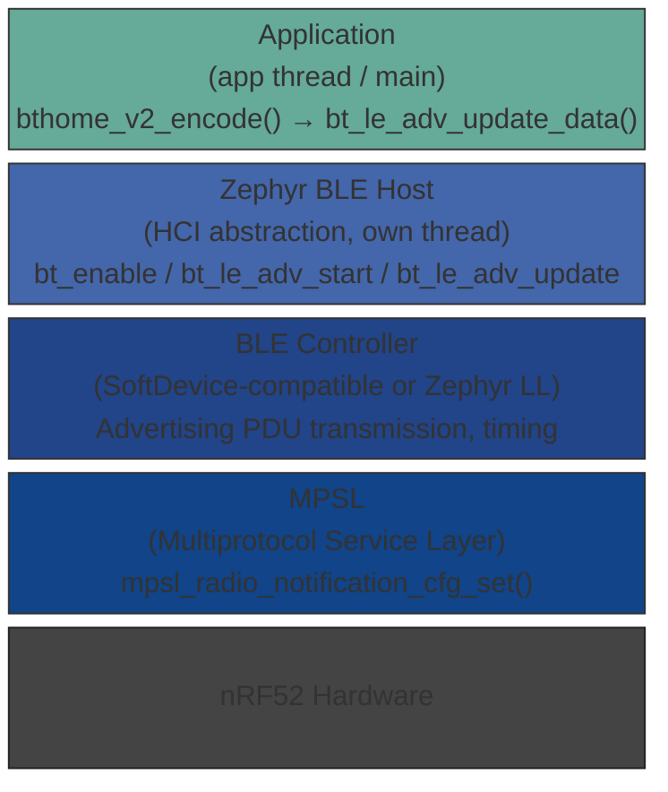

# Zephyr BLE Stack: Hooks and Patterns for Sensor Data Updates

> 🌐 [Deutsche Version](../de/zephyr-ble-stack.md)

This document describes the most important entry points (hooks) of the Zephyr
Bluetooth stack relevant to BThome V2 projects, and explains how this approach
differs from Arduino/PlatformIO and the Nordic SoftDevice.

---

## 1. Architecture Overview

Zephyr strictly separates the BLE stack from application code:



The host stack runs in its own **kernel thread** (`bt_rx`, `bt_tx`).
All API calls from the app thread are thread-safe as long as raw HCI buffers
are not shared directly.

---

## 2. Relevant Hooks in the BLE Stack

### 2.1 `bt_enable()` — Initialisation Callback

```c
// Asynchronous initialisation with callback
bt_enable(bt_ready_cb_t cb);

// Callback signature
static void bt_ready(int err) {
    if (err == 0) {
        bt_le_adv_start(...);
    }
}
```

**When to use:** When BLE init takes longer (e.g. with `CONFIG_BT_SETTINGS`
enabled — Flash-stored bonds are loaded on startup).  
**For BThome:** Synchronous `bt_enable(NULL)` followed by a direct call to
`bt_le_adv_start()` is usually sufficient since bonding is not required.

---

### 2.2 `bt_le_adv_start()` / `bt_le_adv_update_data()`

```c
// Start advertising
int bt_le_adv_start(const struct bt_le_adv_param *param,
                    const struct bt_data *ad, size_t ad_len,
                    const struct bt_data *sd, size_t sd_len);

// Replace the running advertisement payload (no stop/start required)
int bt_le_adv_update_data(const struct bt_data *ad, size_t ad_len,
                          const struct bt_data *sd, size_t sd_len);
```

`bt_le_adv_update_data()` is the **central hook for BThome**: it atomically
swaps the service-data buffer of the running advertising set without
interrupting the BLE advertising sequence.

**BThome pattern** (as implemented in `010_bthome-tut1`):

```c
// In the app thread, every N seconds:
bthome_v2_clear(&bthome);
bthome_v2_add_packet_id(&bthome, pkt_id++);
sensor_die_temp_update(&bthome);   // populate measurements
sensor_imu_update(&bthome);
bthome_v2_encode(&bthome);         // sort by OBJ_ID, fill buffer
bthome_v2_get_bt_data(&bthome, &ad[2]);
bt_le_adv_update_data(ad, ARRAY_SIZE(ad), NULL, 0); // atomic handoff
```

---

### 2.3 Extended Advertising — `bt_le_ext_adv_*`

From Zephyr 3.x / NCS 2.x onwards an extended advertising API is available:

```c
struct bt_le_ext_adv *adv;
bt_le_ext_adv_create(&param, &cb, &adv);
bt_le_ext_adv_set_data(adv, ad, ad_len, NULL, 0);
bt_le_ext_adv_start(adv, &start_param);
```

Callbacks (`struct bt_le_ext_adv_cb`):

| Callback | When triggered |
|----------|----------------|
| `sent` | After every transmitted advertising event |
| `scanned` | When a scanner responds to the advertisement (scan response) |
| `connected` | On incoming connection (connectable advertising) |

**Relevant for BThome:** The `sent` callback allows sensor data to be updated
**exactly after each transmitted packet** — more fine-grained than a
sleep-based loop. Requires `CONFIG_BT_EXT_ADV=y`.

```c
static struct bt_le_ext_adv_cb adv_cb = {
    .sent = on_adv_sent,
};

static void on_adv_sent(struct bt_le_ext_adv *adv,
                        struct bt_le_ext_adv_sent_info *info)
{
    // Called after every ADV event in the BT host thread
    // → schedule a k_work to read sensors in the app thread
    k_work_submit(&sensor_update_work);
}
```

> **Note:** The callback runs in the BT host thread. Sensor I²C accesses
> must be offloaded to the app thread via `k_work` or `k_msgq`.

> **Energy-saving tip:** Performing the sensor update *after* transmitting is
> the optimal strategy because the MCU and radio are already active at that
> moment. Scheduling the measurement *before* the send would require either
> **two wake-ups per cycle** (one for the measurement, one for TX) or keeping
> the system **continuously awake** between measurement and TX — both waste
> significantly more energy. With the `sent` callback there is exactly
> **one active window per interval**, used for both transmission and
> preparing fresh data for the next packet.

---

### 2.4 `k_work` / `k_work_delayable` — Recommended Pattern

For sensor-driven updates without a blocking sleep:

```c
static struct k_work_delayable adv_update_work;

static void do_adv_update(struct k_work *work)
{
    // Read sensors and update advertisement
    update_advertisement();
    // Schedule the next update
    k_work_reschedule(&adv_update_work, K_SECONDS(ADVERT_INTERVAL_SEC));
}

int main(void)
{
    k_work_init_delayable(&adv_update_work, do_adv_update);
    // ...BT enable, adv start...
    k_work_reschedule(&adv_update_work, K_NO_WAIT);

    // Main thread can sleep or handle other tasks
    k_sleep(K_FOREVER);
}
```

This pattern is preferred over a plain `while(true) + k_sleep()` when
multiple timed tasks need to run in parallel.

---

### 2.5 Pre-Send Hook — Does Zephyr / NCS Have One?

**Correction of a common misconception:** The Zephyr BLE Host API itself
provides no such hook — however, the **MPSL (Multiprotocol Service Layer)**
in the nRF Connect SDK (NCS) does. `mpsl_radio_notification_cfg_set()` from
`<mpsl_radio_notification.h>` is the direct, complete replacement for the
legacy SoftDevice function `ble_radio_notification_init()`.

#### MPSL Radio Notification (NCS / nrfxlib)

```c
#include <mpsl_radio_notification.h>

// Configure once while MPSL is idle (e.g. before bt_enable())
mpsl_radio_notification_cfg_set(
    MPSL_RADIO_NOTIFICATION_TYPE_INT_ON_ACTIVE,  // ACTIVE signal before every radio event
    800,                                         // distance_us: 50–5500 µs lead time
    radio_notify_cb);

// Callback runs in a software ISR (SWI/EGU) — NOT a Zephyr thread!
static void radio_notify_cb(mpsl_radio_notification_source_t src)
{
    if (src == MPSL_RADIO_NOTIFICATION_SOURCE_ACTIVE) {
        // Fired ~800 µs BEFORE every radio event
        // → trigger sensor DMA, pre-compute buffer
        // WARNING: ISR context — no k_sleep(), no direct I²C!
    }
}
```

**API overview** (`mpsl_radio_notification.h`):

| Symbol | Meaning |
|---|---|
| `MPSL_RADIO_NOTIFICATION_TYPE_INT_ON_ACTIVE` | Interrupt before every radio event |
| `MPSL_RADIO_NOTIFICATION_TYPE_INT_ON_INACTIVE` | Interrupt after every radio event |
| `MPSL_RADIO_NOTIFICATION_TYPE_INT_ON_BOTH` | Before and after every event |
| `MPSL_RADIO_NOTIFICATION_DISTANCE_MIN_US` | 50 µs (minimum) |
| `MPSL_RADIO_NOTIFICATION_DISTANCE_MAX_US` | 5500 µs (maximum) |

**Important constraints:**
- Must be configured **before** any protocol stack is active (MPSL idle).
- The callback runs in a software interrupt (SWI/EGU), not a Zephyr thread
  → no blocking Zephyr calls allowed.
- MPSL is part of **nrfxlib** (NCS-specific) and not available in
  vanilla Zephyr without NCS.
- If the gap between radio events is too short (`t_gap < t_ndist`), the
  signal is automatically skipped — safe, but not guaranteed.

**Legacy vs. current comparison:**

| | SoftDevice | MPSL (NCS/Zephyr) |
|---|---|---|
| Header | `ble_radio_notification.h` | `mpsl_radio_notification.h` |
| Configuration function | `ble_radio_notification_init()` | `mpsl_radio_notification_cfg_set()` |
| Configurable lead time | 200 µs – 5.5 ms | 50 µs – 5,500 µs |
| Signal mechanism | SWI/EGU | SWI/EGU |
| Availability | S132/S140 | NCS ≥ 1.4, nrfxlib/mpsl |

For BThome with 10 s intervals the `sent` callback is simpler and
sufficient. MPSL radio notifications pay off for timing-critical use cases
(e.g. starting sensor DMA exactly 1 ms before TX).

---

### 2.6 Connection Callbacks (`bt_conn_cb`)

For connectable advertising (not standard BThome, but extensible):

```c
static struct bt_conn_cb conn_callbacks = {
    .connected    = on_connected,
    .disconnected = on_disconnected,
    .security_changed = on_security_changed,
};
bt_conn_cb_register(&conn_callbacks);
```

BThome V2 uses **non-connectable advertising** by default
(`BT_LE_ADV_OPT_USE_IDENTITY` without `BT_LE_ADV_OPT_CONNECTABLE`), so
these callbacks are not relevant in typical nodes.

---

## 3. Comparison: Zephyr vs. Arduino/PlatformIO vs. SoftDevice

### 3.1 Arduino / PlatformIO (nRF52-arduino BSP)

| Feature | Arduino/PlatformIO |
|---------|-------------------|
| BLE stack | Bluefruit wrapper around SoftDevice S140 |
| Advertising update | `Bluefruit.Advertising.restartOnDisconnect()`, no direct `update_data()` — usually stop/start required |
| Threading | Cooperative scheduling via `loop()`, no real RTOS |
| Hooks | Callback functions (`Bluefruit.setConnectCallback()`), but no sent-event for non-connectable ADV |
| BThome integration | Manual `uint8_t` array filling, no type-safe library API |
| Sensor timing | `delay()` in loop blocks all other tasks |

**Summary:** Arduino is beginner-friendly but poorly suited for cleanly timed
multi-channel sensing applications.

---

### 3.2 Nordic SoftDevice (bare-metal, no RTOS)

| Feature | SoftDevice (S140) |
|---------|-------------------|
| BLE stack | Proprietary binary library from Nordic, runs in its own memory region |
| Advertising update | `sd_ble_gap_adv_set_configure()` — buffer pointer is resolved on next ADV event |
| Threading | No RTOS, only SoftDevice events via `sd_app_evt_wait()` + `sd_ble_evt_get()` |
| Hooks | `BLE_GAP_EVT_ADV_SET_TERMINATED`, `BLE_GAP_EVT_CONNECTED` etc. in the event loop |
| Interrupt conflicts | SoftDevice reserves high interrupt priorities; I²C/SPI must use lower priorities |
| Timing accuracy | Very precise since there is no scheduler jitter |

**BThome pattern in SoftDevice style:**

```c
// Event loop (no RTOS)
while (true) {
    sd_app_evt_wait();          // Sleep until SoftDevice event
    uint32_t evt_id;
    while (sd_ble_evt_get(evt_buf, &len) == NRF_SUCCESS) {
        ble_evt_handler((ble_evt_t *)evt_buf);
    }
    if (sensor_update_pending) {
        read_sensors();
        sd_ble_gap_adv_set_configure(...); // swap buffer
        sensor_update_pending = false;
    }
}
```

**Drawback:** No preemptive scheduling — blocking I²C reads during a critical
section can violate SoftDevice timing requirements and cause a HardFault.

---

### 3.3 Zephyr (this stack)

| Feature | Zephyr |
|---------|--------|
| BLE stack | Open-source Zephyr BLE Host + LL (or SoftDevice as controller) |
| Advertising update | `bt_le_adv_update_data()` — atomic, without interrupting advertising |
| Threading | Preemptive RTOS with configurable thread priorities |
| Hooks | `bt_le_ext_adv_cb.sent`, `bt_conn_cb`, `bt_le_scan_cb_t`, `bt_gatt_*` |
| Interrupt conflicts | Zephyr manages priorities; sensor drivers run in kernel thread context |
| Timing accuracy | Slightly more jitter than bare-metal SoftDevice, but well controllable via `k_work_delayable` |
| Portability | Board-independent via DTS; same code for nRF52840-DK and XIAO |

**Summary:** Zephyr offers the best trade-off between structure, portability
and real-time properties for BThome nodes with multiple sensors.

---

## 4. Recommended Kconfig for BThome Nodes

```kconfig
# Enable Bluetooth
CONFIG_BT=y
CONFIG_BT_PERIPHERAL=y          # Not strictly required for non-connectable ADV,
                                 # but useful for future extensions
CONFIG_BT_DEVICE_NAME="MAKE-BThome"

# Extended Advertising (optional, for sent callback)
# CONFIG_BT_EXT_ADV=y

# Logging
CONFIG_LOG=y
CONFIG_BT_DEBUG_LOG=n           # Enable only for deep BLE debugging

# Sensor drivers (board-specific)
CONFIG_SENSOR=y
CONFIG_MPU6050=y                # or CONFIG_LSM6DSL=y for XIAO Sense
```

---

## 5. Further Reading

- [Zephyr BLE API Docs](https://docs.zephyrproject.org/latest/connectivity/bluetooth/api/gap.html)
- [BThome V2 Specification](https://bthome.io/format/)
- [Nordic SoftDevice S140 Product Page](https://www.nordicsemi.com/Products/Development-software/S140)
- [Bluefruit nRF52 Arduino Library](https://github.com/adafruit/Adafruit_nRF52_Arduino)
