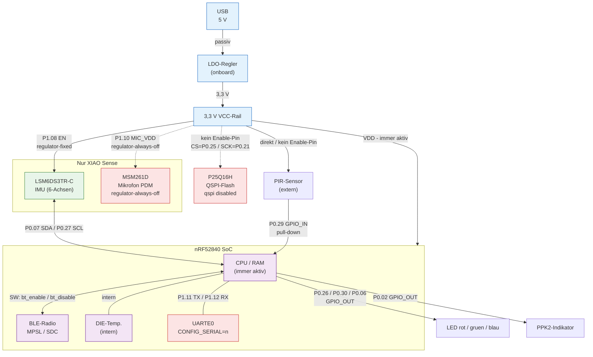

# 020_bthome_tut2

Full BThome V2 sensor node — tutorial sample 2: **Power-Managed Node**.

Baut auf Tutorial 1 auf und ergänzt Zephyr Power Management:

- **Burst-Advertising**: Pro Zyklus wird das BLE-Radio für **3 s** aktiv
  geschaltet, dann mit `bt_disable()` vollständig abgeschaltet (HFCLK frei).
- **Deep Sleep**: Die verbleibenden **27 s** verbringt der nRF52840 im
  „System ON / CPU asleep"-Zustand (~3–15 µA).
- **Peripherie-Suspend**: I²C-Bus und IMU-Sensor werden zwischen den Messungen
  per `pm_device_action_run()` suspendiert.
- **PPK2-Indikator**: P0.02 (XIAO D0) wird HIGH/LOW getaktet, um Wach- und
  Schlafphasen im PPK2 korrelieren zu können.

Das Gerät sendet alle **30 Sekunden** einen neuen BThome-Paket-Burst
(non-connectable, undirected).

## Sensoren

| # | Sensor | Quelle | Immer vorhanden |
|---|---|---|---|
| 1 | Die-Temperatur | nRF52840 intern (`TEMP_NRF5`) | ✓ |
| 2 | Beschleunigung + Gyroskop-Betrag | MPU-6050 (DK) oder LSM6DS3TR-C (XIAO Sense) via DT-Alias `imu` | Board-abhängig |
| 3 | PIR-Bewegung (binär) | GPIO, DT-Alias `pir-sensor` | Board-abhängig |

LED2 (Alias `led1`) blinkt **50 ms** bei jeder Werteaktualisierung als
visueller Heartbeat.

## Unterstützte Boards

| Board | `BOARD`-Wert | IMU-Treiber |
|---|---|---|
| nRF52840-DK | `nrf52840dk_nrf52840` | MPU-6050 (`CONFIG_MPU6050=y`) |
| Seeed XIAO nRF52840 Sense | `xiao_ble_sense` | LSM6DSL (`CONFIG_LSM6DSL=y`) |
| Seeed XIAO nRF52840 (plain) | `xiao_ble` | — (kein IMU) |

## Build & flash

```bash
# nRF52840-DK
west build -b nrf52840dk_nrf52840 samples/020_bthome_tut2
west flash

# Seeed XIAO nRF52840 Sense
west build -b xiao_ble_sense samples/020_bthome_tut2
west flash

# Seeed XIAO nRF52840 (plain, ohne IMU)
west build -b xiao_ble samples/020_bthome_tut2
west flash
```

## Verify with bthome-logger

```bash
uv tool install bthome-logger
bthome-logger -f "MAKE-020"
```

## Dateien

```
020_bthome_tut2/
├── CMakeLists.txt
├── prj.conf                        # Gemeinsames Kconfig (BT, Sensoren, PM)
├── src/
│   ├── main.c                      # BLE-Burst-Loop mit bt_enable/bt_disable
│   └── sensors/
│       ├── sensor_die_temp.h/.c    # Interne Temperatur
│       ├── sensor_imu.h/.c         # IMU (bedingt durch HAS_IMU)
│       └── sensor_pir.h/.c         # PIR GPIO (bedingt durch HAS_PIR)
└── boards/
    ├── nrf52840dk_nrf52840.conf     # CONFIG_MPU6050=y, SERIAL=n
    ├── nrf52840dk_nrf52840.overlay  # I²C + IMU + PIR + PPK2-Indikator
    ├── xiao_ble.conf                # LFRC, USB/SERIAL=n, BT_UNINIT_MPSL=y
    ├── xiao_ble.overlay             # PIR + PPK2-Indikator (kein IMU)
    ├── xiao_ble_sense.conf          # CONFIG_LSM6DSL=y, LFRC, USB/SERIAL=n
    └── xiao_ble_sense.overlay       # IMU-Alias + PIR + PPK2-Indikator
```

## Key Kconfig options

| Option | Zweck |
|---|---|
| `CONFIG_BT=y` | Bluetooth aktivieren |
| `CONFIG_BT_PERIPHERAL=y` | Peripheral / Advertiser-Rolle |
| `CONFIG_BTHOME_V2=y` | BThome V2 Bibliothek |
| `CONFIG_TEMP_NRF5=y` | nRF52 interne Temperaturtreiber |
| `CONFIG_MPU6050=y` | IMU-Treiber für nRF52840-DK |
| `CONFIG_LSM6DSL=y` | IMU-Treiber für XIAO Sense |
| `CONFIG_PM_DEVICE=y` | Geräte-PM: suspend/resume via `pm_device_action_run()` |
| `CONFIG_TICKLESS_KERNEL=y` | SysTick stoppt im Sleep (~300 µA gespart) |
| `CONFIG_BT_UNINIT_MPSL_ON_DISABLE=y` | MPSL vollständig deinitialisieren bei `bt_disable()` → HFCLK frei |
| `CONFIG_MPSL_DYNAMIC_INTERRUPTS=y` | Abhängigkeit von `BT_UNINIT_MPSL_ON_DISABLE` |

## Power-Architektur

Das folgende Diagramm zeigt den Stromversorgungspfad von USB (5 V) bis zu den
einzelnen Peripheriegeräten.  
**Kantenbeschriftung:** der GPIO-Pin, der die jeweilige Versorgung aktiviert
(oder `SW:` für rein softwaregesteuerte Schaltung).  
Gestrichelte Pfeile (`-.->`) kennzeichnen Pfade, die durch Konfiguration
deaktiviert sind.  
Mit *Sense only* gekennzeichnete Knoten existieren nur auf dem
**XIAO nRF52840 Sense**.



## Related documentation

- [Zephyr BLE Stack — Hooks and Patterns](../../doc/en/zephyr-ble-stack.md)
