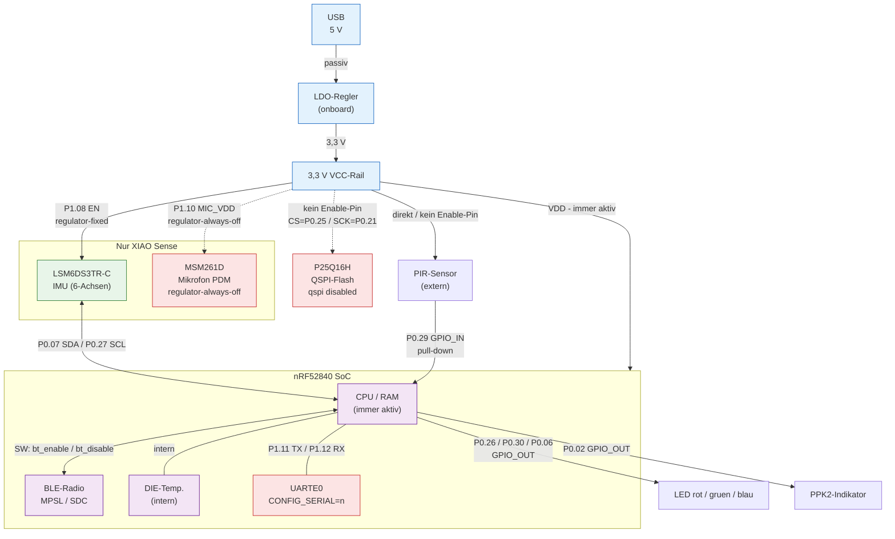

# 010_bthome-tut1

Full BThome V2 sensor node — tutorial sample 1.

Demonstrates how to combine multiple sensor sources into a single
**BThome V2** BLE advertisement using the `bthome_v2` Zephyr library.
A new packet is broadcast every 10 seconds (non-connectable, undirected).

## Sensors

| # | Sensor | Source | Always present |
|---|---|---|---|
| 1 | Die temperature | nRF52840 internal (`TEMP_NRF5`) | ✓ |
| 2 | Acceleration + gyroscope magnitude | MPU-6050 (DK) or LSM6DS3/LSM6DSL (XIAO Sense) via DT alias `imu` | Board-dependent |
| 3 | PIR motion (binary) | GPIO, DT alias `pir-sensor` | Board-dependent |

LED2 (`led1` alias) flashes for **50 ms** on every advertisement update as a
visual heartbeat.

## Supported boards

| Board | `BOARD` value | IMU driver |
|---|---|---|
| nRF52840-DK | `nrf52840dk/nrf52840` | MPU-6050 (`CONFIG_MPU6050=y`) |
| Seeed XIAO nRF52840 Sense | `seeed_xiao_ble/nrf52840` | LSM6DSL (`CONFIG_LSM6DSL=y`) |

## Build & flash

```bash
# nRF52840-DK
west build -b nrf52840dk/nrf52840    samples/010_bthome-tut1
west flash

# Seeed XIAO nRF52840 Sense
west build -b seeed_xiao_ble/nrf52840 samples/010_bthome-tut1
west flash
```

## Verify with bthome-logger

```bash
uv tool install bthome-logger
bthome-logger -f "MAKE"
```

## Files

```
010_bthome-tut1/
├── CMakeLists.txt
├── prj.conf                        # Common Kconfig (BT, sensors, logging)
├── src/
│   ├── main.c                      # BLE advertising loop
│   └── sensors/
│       ├── sensor_die_temp.h/.c    # Internal temperature
│       ├── sensor_imu.h/.c         # IMU (conditional on HAS_IMU)
│       └── sensor_pir.h/.c         # PIR GPIO (conditional on HAS_PIR)
└── boards/
    ├── nrf52840dk_nrf52840.conf     # CONFIG_MPU6050=y
    ├── nrf52840dk_nrf52840.overlay  # I²C + IMU + PIR node
    ├── seeed_xiao_ble.conf          # CONFIG_LSM6DSL=y
    └── seeed_xiao_ble.overlay       # I²C + IMU node
```

## Key Kconfig options

| Option | Purpose |
|---|---|
| `CONFIG_BT=y` | Enable Bluetooth |
| `CONFIG_BT_PERIPHERAL=y` | Peripheral / advertiser role |
| `CONFIG_BTHOME_V2=y` | BThome V2 library |
| `CONFIG_TEMP_NRF5=y` | nRF52 internal temperature driver |
| `CONFIG_MPU6050=y` | IMU driver for nRF52840-DK |
| `CONFIG_LSM6DSL=y` | IMU driver for XIAO Sense |

## Power-Architektur

Das folgende Diagramm zeigt den Stromversorgungspfad von USB (5 V) bis zu den
einzelnen Peripheriegeräten.  
**Kantenbeschriftung:** der GPIO-Pin, der die jeweilige Versorgung aktiviert
(oder `SW:` für rein softwaregesteuerte Schaltung).  
Gestrichelte Pfeile (`-.->`) kennzeichnen Pfade, die durch Konfiguration
deaktiviert sind.  
Mit *Sense only* gekennzeichnete Knoten existieren nur auf dem
**XIAO nRF52840 Sense**.



## Related documentation

- [Zephyr BLE Stack — Hooks and Patterns](../../doc/en/zephyr-ble-stack.md)
